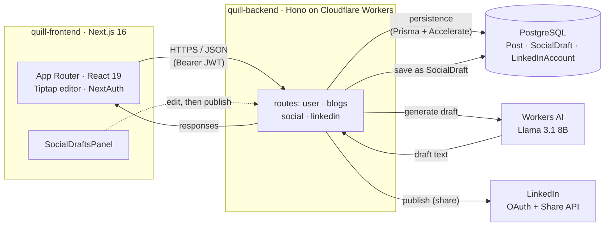

<div align="center">


# Quill

**A modern, Medium-inspired publishing platform for writers who love clean tools.**

Write. Publish. Share. Repeat.

[Features](#features) · [Tech Stack](#tech-stack) · [Architecture](#architecture) · [Project Structure](#project-structure) · [Getting Started](#getting-started) · [API](#api-reference)

</div>

---

## Overview

**Quill** is a full-stack blogging platform that pairs a polished Next.js reading and writing experience with a fast, serverless Hono API running on Cloudflare Workers. It ships with a rich Tiptap editor, NextAuth-based authentication (email/password **and** OAuth), author profiles, a Postgres data layer powered by Prisma Accelerate, and AI-generated social posts that turn a published article into a ready-to-share LinkedIn draft.

This is a **pnpm workspace** monorepo with two packages: `quill-frontend` (Next.js) and `quill-backend` (Hono on Cloudflare Workers).

## Features

### ✍️ Rich Writing Experience

- **Tiptap-powered editor** with headings, bold, italic, underline, highlights, text alignment, and image uploads.
- **Distraction-free writing** with a clean, focused composer UI.
- **Cover images & summaries** to make every post feel like a real publication.
- **Drafts & publishing** — save work in progress, publish when it's ready (publish date is set only when a post goes live).

### 🤖 AI Social Drafts

- **One-click LinkedIn drafts** generated from a post's title, content, and summary using **Cloudflare Workers AI** (`@cf/meta/llama-3.1-8b-instruct`).
- **Engagement-tuned prompt** — strong hooks, concrete examples, format/character limits, and an auto-included code snippet when the article has one.
- **Editable & regenerable** drafts, persisted per post + platform (`SocialDraft`), managed from a drafts panel in the editor.
- **Publish to LinkedIn** directly via connected-account OAuth.

### 📖 Beautiful Reading

- **Typography-first design** using Tailwind Typography for effortless readability.
- **Responsive layouts** and **Framer Motion** micro-interactions for an app-like feel.
- **Light/dark theme toggle** and a redesigned landing experience.
- **Per-author post listings** to binge a writer's work in one place.

### 👤 Author Profiles

- **Avatars, names, and bios** ("About the Author") attached to every post.
- **Profile pages** showcasing an author's published work.

### 🔐 Authentication

- **NextAuth (Auth.js v5)** sessions on the frontend.
- **Email/password** sign-up and sign-in, plus **OAuth** via GitHub, Google, and LinkedIn.
- **JWT** issued for the backend API; the same `JWT_SECRET` signs on the frontend and verifies on the backend.
- **Middleware-protected routes** so the editor and dashboard stay private.
- **Zod-validated** inputs on both client and server.

### ⚡ Performance

- **Edge-fast API** — Hono on Cloudflare Workers for global, low-latency responses.
- **Prisma Accelerate** for cached, connection-pooled Postgres queries.
- **Next.js 16 App Router** with React 19 and SWR for snappy client navigation.

## Tech Stack

| Layer    | Stack                                                                                                          |
| -------- | -------------------------------------------------------------------------------------------------------------- |
| Frontend | Next.js 16, React 19, TypeScript, Tailwind CSS, Tiptap, SWR, Framer Motion, React Hook Form + Zod, NextAuth v5 |
| Backend  | Hono, Cloudflare Workers, Prisma 7 + Accelerate, Wrangler, Workers AI                                          |
| Database | PostgreSQL (via Prisma Accelerate)                                                                             |
| Tooling  | pnpm workspaces, Husky + lint-staged, Prettier                                                                 |

## Architecture



## Project Structure

```
quill/                            # pnpm workspace root
├── package.json                  # workspace scripts (dev runs both apps)
├── pnpm-workspace.yaml
│
├── quill-frontend/               # Next.js App Router app
│   └── src/
│       ├── app/                  # Routes: /, /auth, /blogs, /blog/[id], /editor
│       │   └── api/auth/[...nextauth]/   # NextAuth route handler
│       ├── auth.ts               # NextAuth config (credentials + OAuth)
│       ├── actions/              # Server actions (authActions, socialActions)
│       ├── components/           # UI + feature components (OAuthButtons, SocialDraftsPanel, …)
│       ├── atoms/                # Small primitive components
│       ├── hooks/ · lib/ · utils/
│       ├── types/                # Shared + next-auth type augmentation
│       └── middleware.ts         # Route protection
│
└── quill-backend/                # Hono API on Cloudflare Workers
    ├── src/
    │   ├── index.ts              # App entrypoint, CORS, route mounts
    │   ├── routes/
    │   │   ├── user.ts           # signup / signin / profile
    │   │   ├── blogs.ts          # CRUD for posts
    │   │   ├── social.ts         # generate / read / update / delete social drafts
    │   │   └── linkedin.ts       # LinkedIn OAuth connect + publish
    │   └── lib/                  # generateSocial, socialPrompt, stripHtml
    ├── prisma/
    │   ├── schema.prisma         # User, Post, SocialDraft, LinkedInAccount
    │   └── migrations/
    └── wrangler.jsonc            # Cloudflare Worker config + AI binding
```

## Data Model

```prisma
model User {
  id              String           @id @default(cuid())
  email           String           @unique
  name            String?
  avatar          String?
  password        String?
  aboutAuthor     String?
  posts           Post[]
  linkedinAccount LinkedInAccount?
}

model Post {
  id            String        @id @default(cuid())
  title         String
  content       String?
  image         String?
  summary       String?
  published     Boolean       @default(false)
  publishedDate DateTime?     @db.Date
  authorId      String
  author        User          @relation(fields: [authorId], references: [id])
  socialDrafts  SocialDraft[]
}

model SocialDraft {
  id        String   @id @default(cuid())
  postId    String
  platform  String                         // e.g. "linkedin"
  content   String
  createdAt DateTime @default(now())
  updatedAt DateTime @updatedAt
  post      Post     @relation(fields: [postId], references: [id], onDelete: Cascade)

  @@unique([postId, platform])
  @@index([postId])
}

model LinkedInAccount {
  id          String   @id @default(cuid())
  userId      String   @unique
  accessToken String
  expiresAt   DateTime
  linkedinUrn String
  createdAt   DateTime @default(now())
  updatedAt   DateTime @updatedAt
  user        User     @relation(fields: [userId], references: [id], onDelete: Cascade)
}
```

---

## Getting Started

### Prerequisites

- **Node.js 20+**
- **pnpm 9+** (the repo enforces pnpm via an `only-allow` preinstall hook — `npm install` will fail)
- A **PostgreSQL** database (Neon, Supabase, or any Postgres host)
- A **[Prisma Accelerate](https://www.prisma.io/data-platform/accelerate)** connection string
- A **Cloudflare account** (for the backend Worker + Workers AI)
- OAuth app credentials for **GitHub**, **Google**, and **LinkedIn** (optional, for social sign-in / publishing)

### 1. Clone & install

From the repo root, a single install bootstraps both packages:

```bash
git clone <your-repo-url> quill
cd quill
pnpm install
```

> `postinstall` in the backend runs `prisma generate` automatically.

### 2. Configure the backend — `quill-backend`

Create `quill-backend/.dev.vars` (gitignored) for local Wrangler dev:

```ini
DATABASE_URL="prisma+postgres://accelerate.prisma-data.net/?api_key=..."  # Accelerate URL
JWT_SECRET="a-long-random-secret"        # MUST match the frontend's AUTH_SECRET signing
LINKEDIN_CLIENT_ID="..."                 # for publishing to LinkedIn
LINKEDIN_CLIENT_SECRET="..."
FRONTEND_URL="http://localhost:3000"     # optional (defaults to this)
BACKEND_URL="http://localhost:8787"      # optional (defaults to this)
```

Make sure the **Workers AI binding** is enabled in `quill-backend/wrangler.jsonc` (required for AI drafts):

```jsonc
"ai": {
  "binding": "AI"
}
```

Apply migrations:

```bash
cd quill-backend
pnpm prisma migrate deploy
```

### 3. Configure the frontend — `quill-frontend`

Create `quill-frontend/.env.local`:

```ini
NEXT_PUBLIC_API_URL="http://localhost:8787"   # backend Worker URL (exposed to the browser)

AUTH_SECRET="a-long-random-secret"            # NextAuth session secret (== backend JWT_SECRET)

# OAuth providers (optional)
AUTH_GITHUB_ID="..."
AUTH_GITHUB_SECRET="..."
AUTH_GOOGLE_ID="..."
AUTH_GOOGLE_SECRET="..."
AUTH_LINKEDIN_ID="..."
AUTH_LINKEDIN_SECRET="..."
```

### 4. Run everything

From the **repo root**, start both apps together:

```bash
pnpm dev
```

- Frontend → http://localhost:3000
- Backend → http://localhost:8787

Or run them individually: `pnpm dev:frontend` / `pnpm dev:backend`.

---

## Scripts

**Root** (`/`)

| Command                                  | What it does                        |
| ---------------------------------------- | ----------------------------------- |
| `pnpm dev`                               | Run frontend + backend concurrently |
| `pnpm dev:frontend` / `pnpm dev:backend` | Run one app                         |
| `pnpm build:frontend`                    | Production build of the frontend    |
| `pnpm deploy:backend`                    | Deploy the Worker                   |
| `pnpm lint`                              | Lint all packages                   |
| `pnpm format`                            | Prettier across the repo            |

**Backend** (`quill-backend/`)

| Command           | What it does                            |
| ----------------- | --------------------------------------- |
| `pnpm dev`        | Start the Worker locally with Wrangler  |
| `pnpm deploy`     | Deploy to Cloudflare Workers (minified) |
| `pnpm cf-typegen` | Regenerate Cloudflare binding types     |

**Frontend** (`quill-frontend/`)

| Command      | What it does               |
| ------------ | -------------------------- |
| `pnpm dev`   | Start Next.js in dev mode  |
| `pnpm build` | Production build           |
| `pnpm start` | Serve the production build |
| `pnpm lint`  | ESLint                     |

---

## API Reference

All routes are mounted under `/api/v1` and (except auth) expect an `Authorization: <JWT>` header.

| Method           | Path                                   | Description                              |
| ---------------- | -------------------------------------- | ---------------------------------------- |
| `POST`           | `/api/v1/user/signup`                  | Create an account                        |
| `POST`           | `/api/v1/user/signin`                  | Sign in, returns a JWT                   |
| `GET` / `PUT`    | `/api/v1/user/...`                     | Profile read / update                    |
| `POST` / `PUT`   | `/api/v1/blog/`                        | Create / update a post                   |
| `GET`            | `/api/v1/blog/bulk`                    | List posts                               |
| `GET`            | `/api/v1/blog/:id`                     | Read a post                              |
| `GET`            | `/api/v1/social/:postId`               | Generate/fetch a social draft for a post |
| `PUT` / `DELETE` | `/api/v1/social/:postId`               | Edit / remove a draft                    |
| `GET`            | `/api/v1/linkedin/connect?token=<jwt>` | Start LinkedIn OAuth                     |
| `GET`            | `/api/v1/linkedin/callback`            | OAuth callback                           |
| `POST`           | `/api/v1/linkedin/...`                 | Publish a draft to LinkedIn              |

> Ownership is enforced server-side: social/blog mutations return `403` for posts you don't own and `404` for missing posts.

---

## Deployment

- **Backend** → `cd quill-backend && pnpm deploy`. Set production secrets (not in `wrangler.jsonc`):
  ```bash
  npx wrangler secret put DATABASE_URL
  npx wrangler secret put JWT_SECRET
  npx wrangler secret put LINKEDIN_CLIENT_ID
  npx wrangler secret put LINKEDIN_CLIENT_SECRET
  npx wrangler secret put FRONTEND_URL
  npx wrangler secret put BACKEND_URL
  ```
  Ensure the `AI` binding is present in `wrangler.jsonc`.
- **Frontend** → Deploy to Vercel, Cloudflare Pages, or any Node host. Set `NEXT_PUBLIC_API_URL` to the deployed Worker URL and configure `AUTH_SECRET` + OAuth provider secrets.

## Roadmap Ideas

- More social platforms (X/Bluesky) on top of the existing `SocialDraft` model
- Comments and reactions
- Tags and topic feeds
- Reading time estimates
- RSS feed per author

## License

MIT — do what you love with it.

---

<div align="center">
Built with 🧠 using Next.js, Hono, Prisma, Workers AI, and Cloudflare Workers.
</div>
